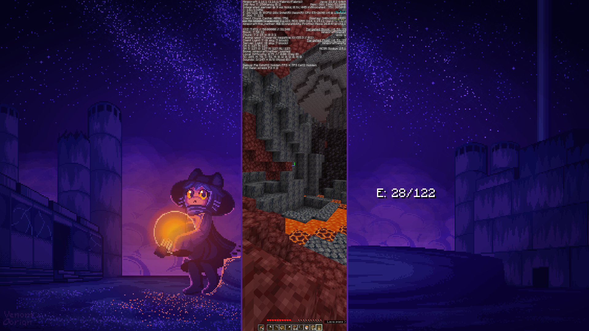
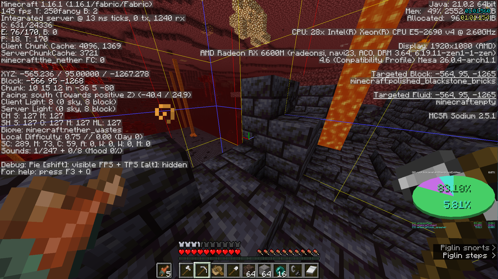
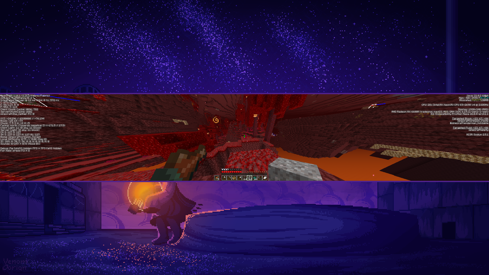
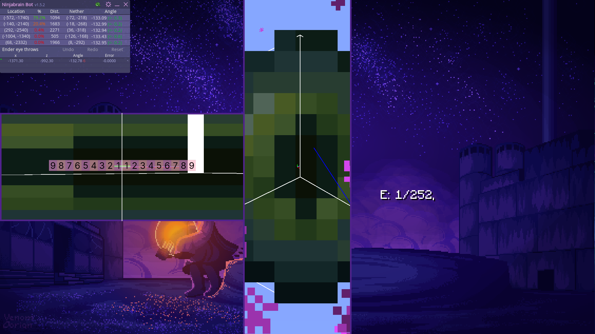
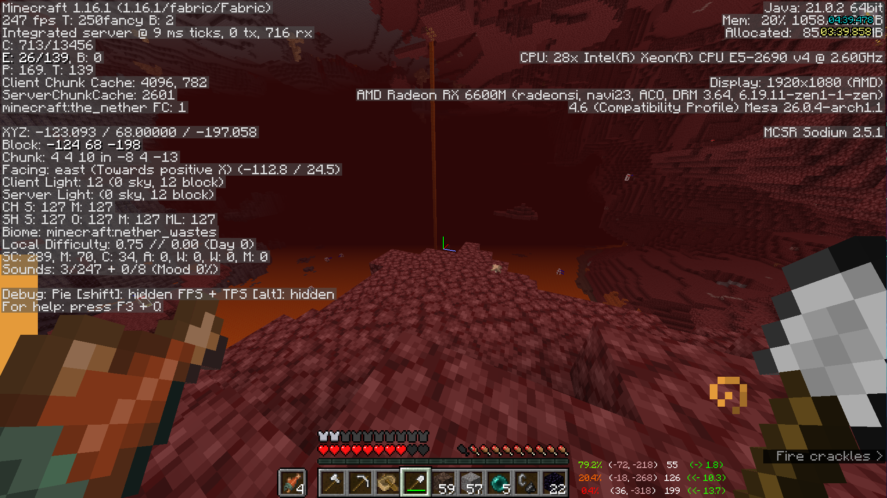
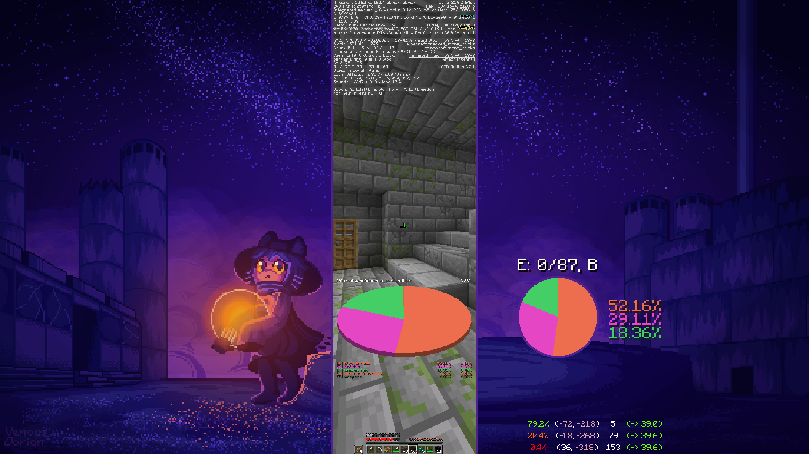
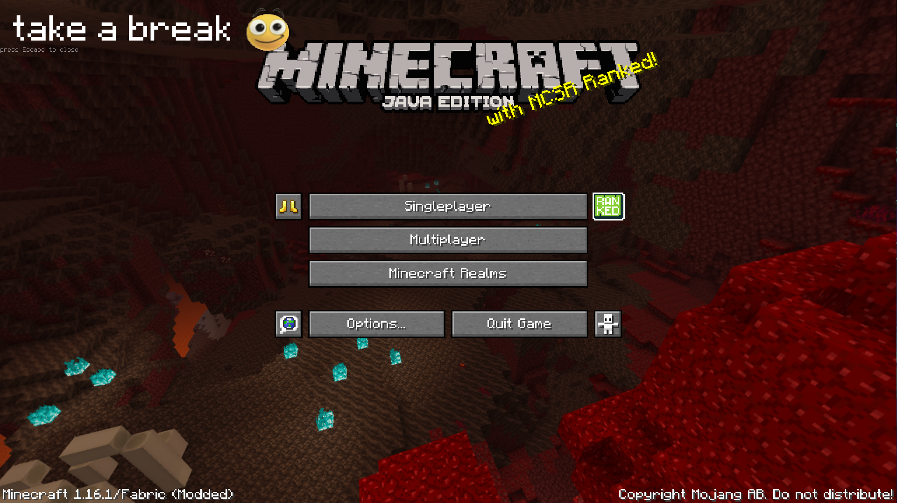

# nml's waywall config

based on gore's barebones and soup's configs with random stuff pulled from the mcsr linux discord, don't remember everything SORREY

this will not work for you unless you have my exact setup (1080p, logitech mouse, hyprland), you can just take stuff from `utils.lua` and `takeabreak/` instead

### features

- ★ auto logitech dpi switch
- ★ disable remap in chat
- ★ transparent nbtracker with hyprland:darkwindow
- ★ link saves to /tmp with maps
- ★ auto disable state functionality for 26.1+
- ★ take a break aga
- tall/thin/wide
- f3 text, pie, glowdar mirrors
- mirror borders
- mpk quickbind

## hyprland config

```properties
windowrule = border_size 0, rounding 0, no_blur on, match:class waywall
windowrule = float on, border_size 0, rounding 0, no_blur on, pin on, no_focus on, workspace 1, darkwindow:shade transparentNB, match:tag nboverlay

input {
    sensitivity = -0.75
}
plugin:darkwindow {
    shader[transparentNB] {
        path = /home/nml/.config/waywall/shaders/NBTracker-transparency.glsl
        args = bkg = [0.121568627 0.137254902 0.168627451] targetOpacity = 0 similarity = 0.7
        introduces_transparency = true
    }
}
```

## screenshots









screenshots taken on 17 april, there may be small differences between the current config