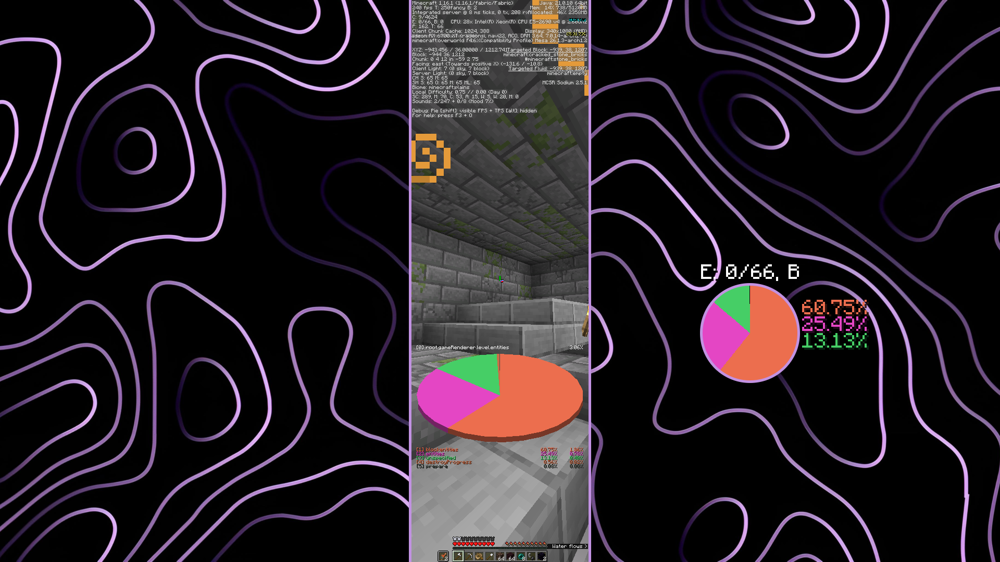
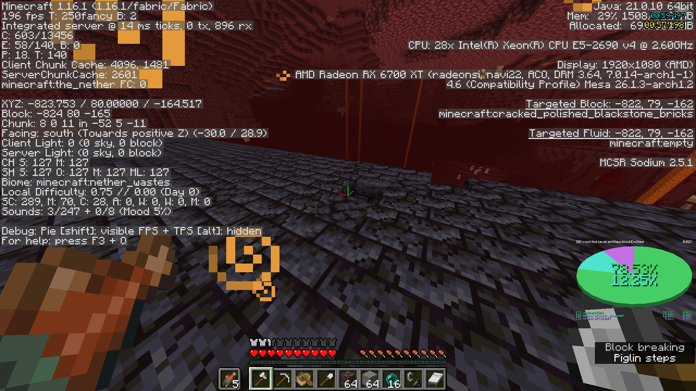
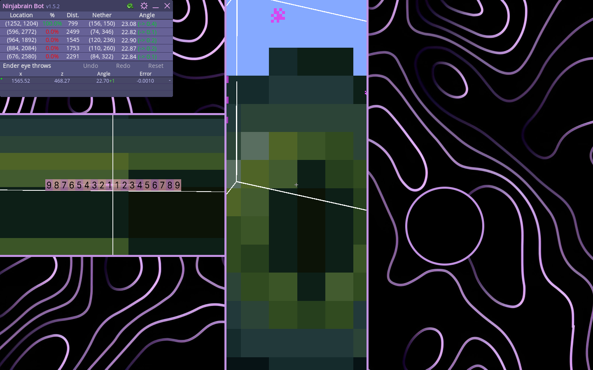
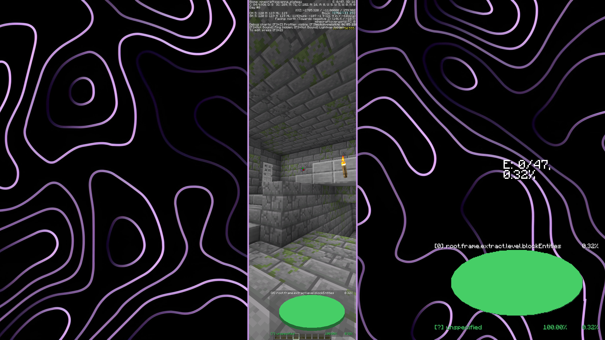

# nml's waywall config V3

fully rewritten to be as easily configurable as possible! cooked a little too hard so this is a little bloated lmao

the purpose of this config is to be able to change all of its aspects (mirrors, resolutions, images, etc) by modifying a single file. the pros of this is having everything in one place and being able to patch the options with profiles. the major downside of this is the complexity of the underlying config itself

if this seems to be too complex and you want a simple config, i recommend the [generic](https://github.com/arjuncgore/waywall_generic_config/) config

loosely based on gore's barebones and soup's configs

## features

- ★ WORKS FOR ALL RESOLUTIONS!!! (check [setup](#setup))
- ★ hyper configurable options file with luals types
- ★ patching options with profiles
- ★ quick setup script
- ★ disable remap in chat
- tall/thin/wide and more
- f3 text, pie, glowdar mirrors
- mirror borders
- mpk quickbind

## setup

0. if you already have an existing config, run
   ```bash
   mv ~/.config/waywall ~/.config/waywall.bkp
   ```
   to backup it
1. clone the config
   ```bash
   git clone https://github.com/thenml/waywall-config.git ~/.config/waywall
   ```
2. run `python3 setup.py`

done! (now go fully read the options)

## profile setup

1. add or choose a profile in `profile/`
2. put `waywall wrap --profile profile/{name} --` as your wrapper command (no .lua at the end!)
   - example: `waywall wrap --profile profile/draftout --`

done!

## updating

if you only changed `options.lua` and `generated.json`, you can just run
```bash
git pull
```
otherwise there may be a **merge conflict** which you will have to resolve

## hermes state output setup

enable experimental script that watches hermes `state.json` and converts it to a `wpstateoutput.txt` that waywall can read. also creates a dummy `fake_stateoutput_for_waywall_hermes_compat.jar` file to trick waywall into reading the state

only use this if you are absolutelly sure you need it and you know what it does

put `bash /home/$USER/.config/waywall/scripts/hermes-compat.sh` **before** the waywall wrapper

example: `bash /home/$USER/.config/waywall/scripts/hermes-compat.sh waywall wrap --profile profile/draftout --`

done!

## extra scripts

the `scripts` folder has some extra scripts that you can use
- `hermes-compat.sh` - see above
- `pre-launch.sh` - example script with some commands you may want to run before launch
- `solaar-watch.py` - if you have a logitech mouse and want to switch dpi instead of sens for some reason
- `tmp-saves.sh` - link your saves to /tmp for perfomance? [citation needed]

## screenshots




